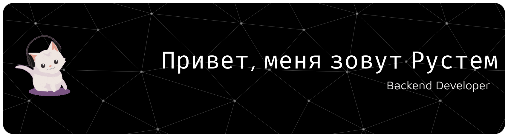

<h3 align="center">Технологии которые я использую:</h3>
<h4 align="center">При нажатии на иконку вы попадете на официальную документацию и сможете узнать для чего используется эта технология.</h4>

                          

