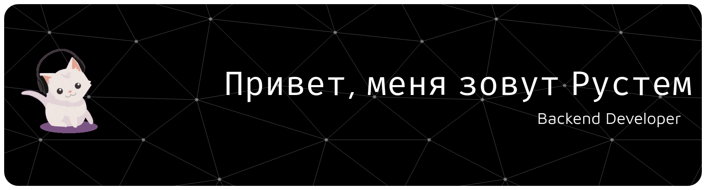

 

# Rustem Emirveliyev

  

---

## Технологии

### Языки

  

### Frontend

  

### Backend

  

### Базы данных

  

### Инструменты

---

## GitHub

---

## Активность

---

## GitHub Trophies

---

## Contributions

<picture>
  <source
    media="(prefers-color-scheme: dark)"
    srcset="https://raw.githubusercontent.com/emirveliyev/emirveliyev/output/github-contribution-grid-snake-dark.svg"
  >
  <source
    media="(prefers-color-scheme: light)"
    srcset="https://raw.githubusercontent.com/emirveliyev/emirveliyev/output/github-contribution-grid-snake.svg"
  >
  
</picture>

---

  

